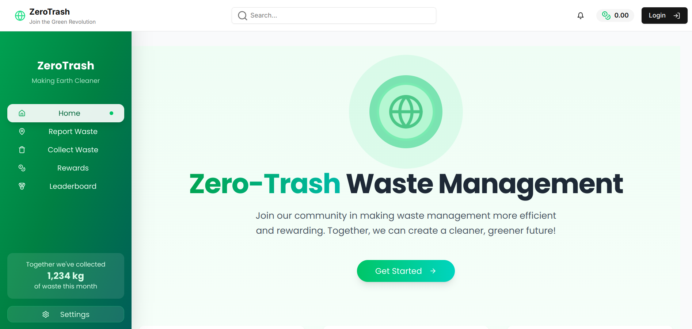
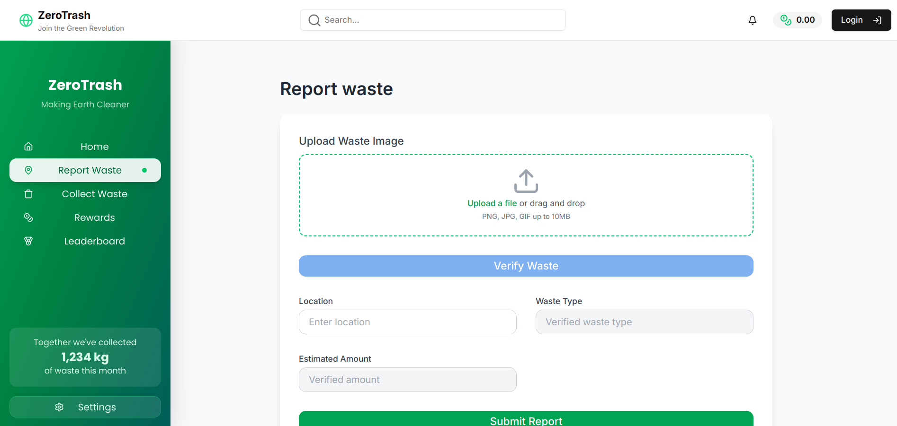
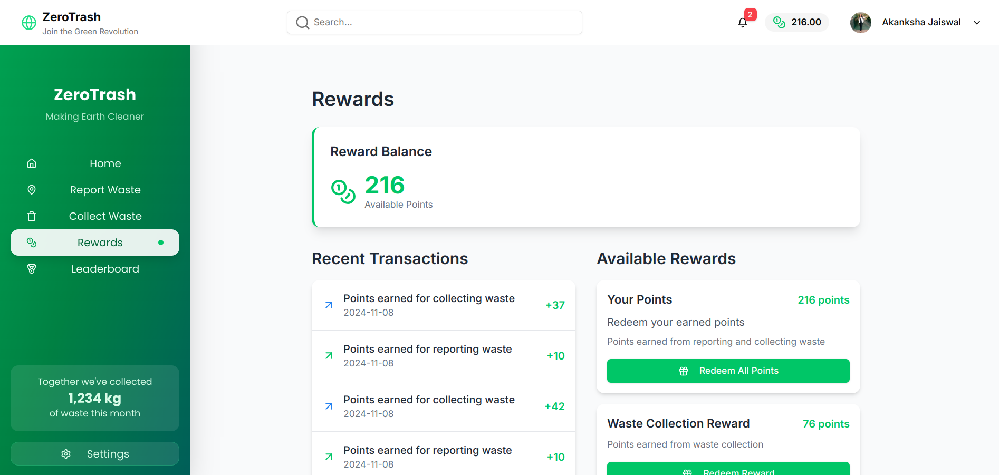

## Hackthisfall virtual 
# ZERO-TRASH (AI POWERED WASTE MANAGEMENT PLATFORM)

## The Problem it solves

Zero-Trash is designed to make waste management more efficient and rewarding. It allows users to report and collect waste, contributing to a cleaner environment. The platform incentivizes users by offering rewards for their contributions, making waste management a community-driven effort. By using AI, it helps in identifying waste types and estimating quantities, thus streamlining the process of waste collection and recycling.

## AI powered verification of waste via Gemini Api

## Earn Rewards for collecting wastes 

## Challenges I ran into

One of the challenges faced during the development of Zero-Trash was integrating AI for waste verification. The AI needed to accurately identify waste types and estimate quantities from images. This required fine-tuning the Gemini AI model and handling various edge cases where the AI might misinterpret the data. Another challenge was ensuring seamless user authentication and data management, which was addressed by integrating Web3Auth for secure login and using a robust database setup for handling user data and rewards.

## Technologies I used

- ReactJS
- Drizzle ORM
- NextJs
- Typescript
- Web3Auth for Authentication
- GEMINI API
- Tailwind css and ShadCN
